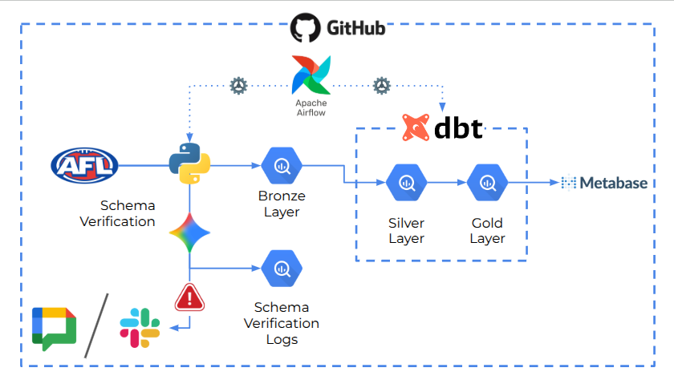

# Australian Football End-to-end Analytics

An end-to-end data engineering portfolio project that ingests, transforms, and visualises Australian Football's (AFL) data using the modern data stack.

---

## Architecture



### Data Flow

**1. Ingest** — A Python script downloads the AFL data by hitting API endpoints as documented in the [API documentation](https://api-sports.io/documentation/afl/v1#tag/Timezone) and extracts 13 endpoints to a local `data/raw` folder. Each table is cleaned and saved as a CSV to a local `data/intermediate/` folder.

**2. Schema Verify** — The schema of ingested data is then verified by comparing it to the ideal/target schema for troubleshooting purposes. This step is assisted by Gen AI to semantically determine whether or not the schema of the ingested data from the API endpoints match the target, which then the verification result is stored as a CSV to a local `data/schema_verification_results/` folder

**3. Load** — An Airflow task uploads the CSVs from `data/raw/` into BigQuery's `bronze` dataset, overwriting the previous run's data on each execution.

**4. Transform** — dbt runs three layers of transformation inside BigQuery:
- **Bronze** — raw source tables, no transformation, direct reflection of the AFL API data
- **Silver** — cleaned and typed models, one per source table, with standardised column names, cast data types, and derived labels
- **Gold** — aggregated mart tables that answer specific business questions, used directly by the dashboard

**5. Visualise** — Looker Studio connects directly to the gold dataset and serves an interactive three-page dashboard.

---

## Tech Stack

| Layer | Tool | Purpose |
|---|---|---|
| Ingestion | Python (`requests`, `pandas`, `google-cloud-bigquery`) | Download and clean AFL's data from API endpoints |
| Schema Verification | Python (`google-cloud-aiplatform`) | Use Gen AI semantics to verify schema |
| Alert Notification | API in Python (`slack-sdk`) | Use Slack Bot API to alert schema verification results |
| Orchestration | Apache Airflow 3.3 | Schedule and sequence pipeline tasks regularly |
| Transformation | dbt Core | Model bronze → silver → gold layers |
| Testing | dbt tests | Schema tests and unit tests for ingestion functions |
| Data Warehouse | Google BigQuery | Store and compute all data layers |
| Visualisation | Metabase | Interactive dashboard on gold layer |
| CI/CD| Git + GitHub | Source control and documentation hosting |

---

## Project Structure

```
australian-football-e2e-analytics/
├── config.py                  # pipeline configuration
├── main.py                      # pipeline entry point
├── utils.py                     # ingestion functions         # pytest unit tests
├── data/
│   └── raw/                     # ingested CSVs (gitignored)
├── dbt_afl/
│   ├── dbt_project.yml
│   ├── profiles.yml             # BigQuery connection (gitignored)
│   ├── macros/
│   │   └── generate_schema_name.sql   # overrides dbt schema naming
│   └── models/
│       ├── bronze/              # raw source models
│       │   └── sources.yml
│       ├── silver/              # cleaned and typed models
│       │   └── schema.yml
│       └── gold/                # aggregated mart models
│           └── schema.yml
├── airflow/
│   └── dags/
│       └── main_dag.py
│       └── config.py
│       └── utils/
├── docker-compose.yml          # used to store metabase configuration

```

---

## Data Source

**API Sports IO**
Published by the API Sports IO and available at [api-sports.io/documentation/afl](https://api-sports.io/documentation/afl/v1) in both free plan (limited access in a set period of time) and paid plan. The API key can be made in the website once a user is registered. There are a total of 13 tables available to be downloaded by hitting the endpoints. However, in this project 6 main tables are being used for the purpose of simplicity.

| Table | Description | Approx. rows count |
|---|---|---|
| `seasons` | All recorded seasons of AFL | ~20 |
| `leagues` | All recorded leagues in AFL | ~20 |
| `games` | All the games of AFL  | ~1000 |r
| `players` | Historical records of the AFL players | ~2,000 |
| `teams` | All the AFL teams | ~20 |
| `standings` | Standings of a competition in relation to a given season | ~50 |

---

## How to Run Locally

### Prerequisites

- Python 3.11+
- A Google Cloud Platform account with a BigQuery-enabled project
- A GCP service account JSON key with `BigQuery Admin` role
- Apache Airflow 3.3+

### 1. Clone the repository

```bash
git clone https://github.com/jasonzelin/australian-football-e2e-analytics.git
cd australian-football-e2e-analytics
```

---

### 2. Set up the Python environment

```bash
python -m venv .venv
source .venv/bin/activate # For Mac/Linux
pip install -r requirements.txt
```

---

### 3. Configure the pipeline

Edit [`config.py`](config.py) with your preferred output directory and other preferred settings and replace variables in [`.env_example`](.env_example) with your environment variables.

---

### 4. Run the ingestion script manually

```bash
python main.py
```
OR, if you are using python3:
```bash
python3 main.py
```

---

## What I'd Improve at Scale

These are the next steps I'd take if this pipeline were running in a production environment rather than a portfolio project:

**Incremental loading** — The current pipeline does a full truncate-and-reload of every table on each run. At production scale, dbt incremental models would only process new or changed records, significantly reducing BigQuery compute costs and run time.

**Separate virtual environments per task** — Airflow's `ExternalPythonOperator` would allow each task to run in its own isolated Python environment, preventing dependency conflicts between the ingestion libraries and dbt as the project grows.

**Secrets management** — Environment variables work for local development but production would use Google Secret Manager, Amazon S3 Secrets Manager or Azure Key Vault to manage the service account credentials, with Airflow's connections store used instead of environment variables.

**Data monitoring** — The AFL data feed from api-sports.io is updated periodically but not on a fixed schedule. A freshness check step in the DAG (using dbt's `source freshness` command) would alert if the source data hasn't changed within an expected window, catching silent feed failures before they propagate to the dashboard. I would setup something like alert system to trigger warning to messenger platforms such as Google Chat's or Slack's webhook.

**Schema Fingerprint Storing** — Schema verification results generated by Gemini AI could produce varying confidence score, depending heavily on the similarity and data types matching of the received schema compared to the ideal schema. Schemas below the minimum threshold is in this current development only stored and notified. The better approach to do if the developing team has sufficient resources is to create a fingerprinting mechanism, so that the same reproduced error would be cachhed in the system and will not flagged as low confidence schema more than once.

**Cloud-hosted Airflow** — Running Airflow locally means the pipeline only runs when my machine is on and hosting the source code. Cloud Composer (GCP's managed Airflow) or Astronomer would give the pipeline true 24/7 scheduling reliability for real use cases.

**Gemini 

---

## Credits

The making of this repository as a github porfolio project gives its credit to [Anupam Phoghat](https://github.com/anupamphoghat), who the author met at GDG Perth's event in Jul 2026. Anupam demonstrated the use of Gemini's Gen AI to verify data schema.


## Author

**Jason Zelin**
Analytics Engineer | Perth, WA
[GitHub](https://github.com/jasonzelin) · [LinkedIn](https://linkedin.com/in/jason-zelin)